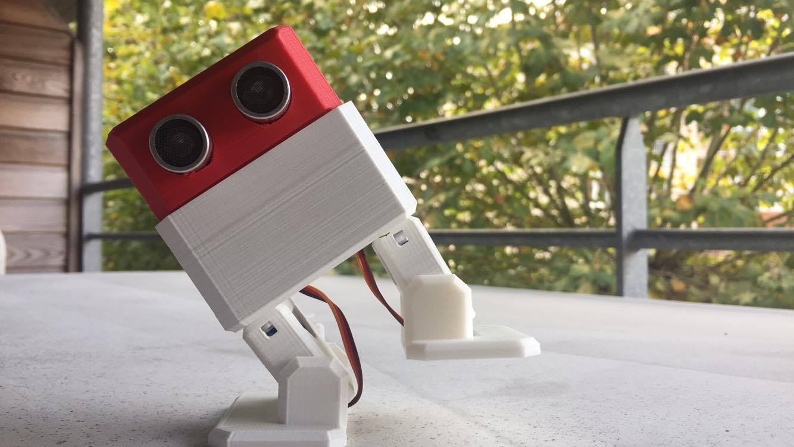
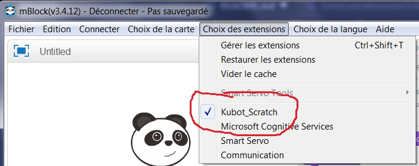
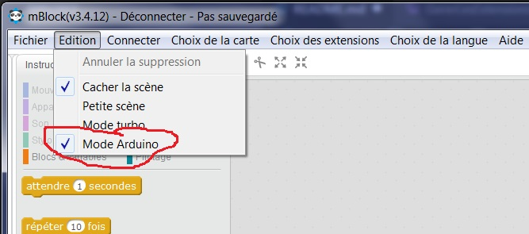
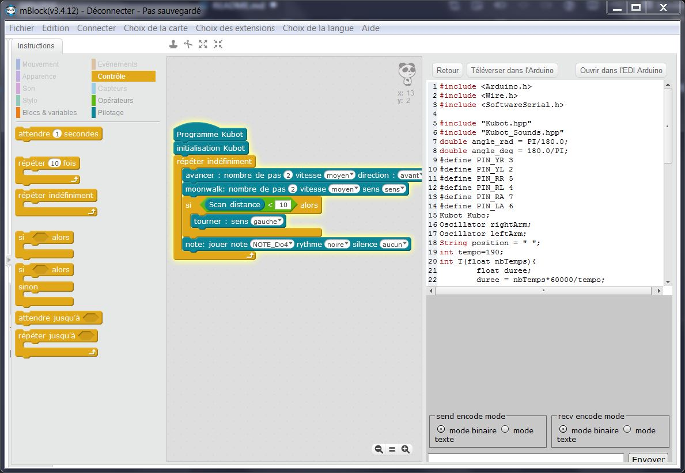

# Kubot
Dépôt pour tous les codes concernant le Kubot.

Inspiré par le robot [Otto DIY](https://github.com/OttoDIY).



## Démarrage/ getting started
### Installation arduino non officiel
Si votre Arduino est non officiel, il peut être impossible d'y accèder lorsque vous la branchez votre ordinateur. Pour cela il faut installer le driver CH341SER-EXE.zip présent dans le dossier **Programmes**.

### Configurer l'IDE Arduino

Pour utiliser le Kubot, il faut installer la bibliothèque sur votre ordinateur, c'est à dire copier le contenu du dossier "Librairies" de ce dépot dans le dossier "D:\Documents\\**VotreNomUtilisateur**\Documents\Arduino\libraries" (accès via mes documents sur Windows). Les librairies seront alors accessible depuis l'IDE Arduino.

### Configurer mBlock
Il est recommandé d'utiliser la version 3.4 de mBlock.
[Télécharger mBlock v3.4. ici](https://dl.makeblock.com/mblock3/mBlock_win_V3.4.12.exe).

Maintenant, il faut installer l'extension Kubot_Scratch.

* Sur le clavier, appuyer sur : touche windows + touche R


Une fenêtre comme cela doit s'ouvrir.
* Saisir : %appdata%
* Dans l'explorateur de fichier qui s'est ouvert, naviguer vers le dossier **libraries** :

```Roaming\com.makeblock.Scratch3.4.12\Local Store\mBlock\libraries```
* Copier le dossier **Kubot_Scratch** de ce depot GitHub dans le dossier **libraries** de mBlock.
### Utiliser mBlock
* On vérifie que **Kubot_Scratch** s'est bien installé. On va chercher dans l'onglet *Choix des extensions*, puis fenêtre *Gérer les extensions*, cliquer sur l'onglet *Installées*. On voit l'extension en verte dans l'image.


* Maintenant on active l'extension ici (entouré en rouge)


* Enfin on active le mode Arduino (entouré en rouge)



Voici un exemple de programme pouvant être réalisé. Les blocs Programme Kubot et Initialisation Kubot sont nécessaires. Les blocs sont rangés par type (contrôle en jaune, opérateurs en vert, pilotage en bleu). La forme des blocs doit être respecté, par exemple le scan distance doit être mis dans un bloc opérateur en vert (forme ovale).




## Kubot_Application_Mobile
Code de l'application pour mobile Android développé pendant le cours de Système Mobile Communicant.
L’interface graphique peut être travaillé via [ce site du MIT](http://appinventor.mit.edu/explore/#).
Ce programme a été écrit par Florent Paulin.

## Kubot_Scratch
**Utilisable seulement sous mBlock V3**

Bibliothèque du logiciel mBlock V3 développé pour l'animation en partenariat avec la médiathèque de Biarritz. 
Mise en place par Flavien Dumas

Liste des fonctions scratch pour Kubot :
* Initialisation
* Mouvements :
    * Home (retour en position repos)
    * Avancer
    * Reculer
    * Tourner
    * Soulever un pied
    * Pointe des pieds
    * Danser
    * Se pencher

TODO
* [ ] fonction mouvement bras
* [ ] Lever le bras

Capteurs :
Capter la distance avec US

Bluetooth :
* [ ] TODO recevoir/envoyer info bluetooth

Signaux :
* [ ] TODO affichage Matrice LED
* chanter une chanson
* créer une chanson avec des notes


## Librairies
Librairie des robots interactifs Kubot

Développées par Hynek Vignon et Raphaël Ollando

## Programmes
Programmes clés en main à mettre sur la carte Arduino du Kubot

## TODO
* [X] faire la fusion des codes de bibliothèque
* [ ] faire une notice pour l'application Bluetooth

# License
* en: All codes specified with a licence in the header or in a file  are under there own conditions, others codes is under GNU GPL.
* fr: Tous les codes spécifiés avec une licence dans l'en-tête ou dans un fichier sont soumis à leurs propres conditions, les autres codes sont sous licence GNU GPL.