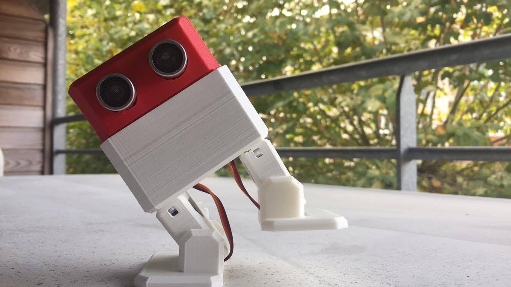

# Kubot
Dépôt pour tous les codes concernant le Kubot.

## Kubot_Application_Mobile
Code de l'application pour mobile Android développé pendant le cours de Système Mobile Communicant.
L’interface graphique peut être travaillé via [ce site du MIT](http://appinventor.mit.edu/explore/#).
Ce programme a été écrit par Florent Paulin.

## Kubot_Scratch
Scratch MkBlock V3
Bibliothèque du logiciel MkBlock V3 développé pour l'animation en partenariat avec la médiathèque de Biarritz, 
Mise en place par Flavien Dumas

Liste des fonctions scratch pour Kubot :
* Initialisation
* Mouvements :
    * Home (retour à 0)
    * Avancer
    * Reculer
    * Tourner
    * Soulever un pied
    * Pointe des pieds
    * Danser
    * Se pencher

TODO
- [ ] fonction mouvement bras
- [ ] Lever le bras

Capteurs :
Capter la distance avec US

Bluetooth :
- [ ] TODO : recevoir/envoyer info bluetooth

Signaux :
- [ ] TODO affichage Matrice LED
* chanter une chanson
* créer une chanson donc un note

## Librairies
Librairie des robots interactifs Kubot

Développé par Hynek Vignon et Raphaël Ollando

## Programmes
Programmes clés en main à mettre sur la carte Arduino du Kubot

## TODO
- [ ] faire la fusion des codes de bibliothèque
- [ ] faire une notice pour l'application Bluetooth